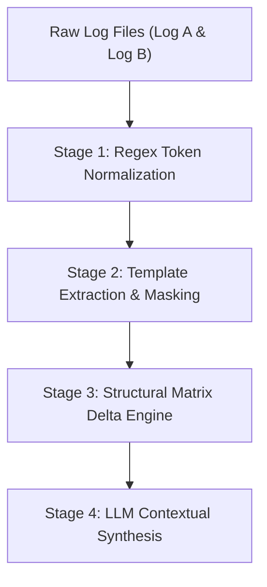

# AI Log Diffing Architecture & Research Specification

**Author:** `edge-ai` AI System Architecture Taskforce  
**Timestamp Standard:** `260720_0812_001`  
**Status:** Active Research & Implementation

---

## 1. Executive Summary & Industry Background

In modern edge computing, SLM inference validation, and multi-backend compilation platforms (such as Intel SYCL, Vulkan, OpenVINO, and LiteRT), build and test logs serve as primary diagnostic artifacts.

However, traditional line-diff tools (`diff -u`) are ineffective for log analysis due to noise pollution:
- **Timestamp Fluctuation**: Line timestamps differ on every run.
- **Pointer/Memory Address Changes**: Dynamic memory allocations (`0x7f...`) produce false positive diff lines.
- **Thread Reordering**: Multi-threaded compilation and async tasks interleave log lines non-deterministically.

Recent industry advancements (Splunk AI, OpenObserve, Coralogix, and open-source log parsing frameworks like LogPai / Drain) demonstrate that **Semantic Log Diffing** using structural log templates combined with LLM reasoning drastically reduces mean time to resolution (MTTR).

---

## 2. The 4-Stage Pipeline Architecture

### Stage 1: Regex Token Normalization
Raw log lines are stripped of non-deterministic volatile variables:
- Timestamps: `\d{4}-\d{2}-\d{2}T\d{2}:\d{2}:\d{2}` $\rightarrow$ `<TIMESTAMP>`
- Hex Memory Addresses: `0x[0-9a-fA-F]+` $\rightarrow$ `<HEX_ADDR>`
- IP / Socket Ports: `\d{1,3}\.\d{1,3}\.\d{1,3}\.\d{1,3}:\d+` $\rightarrow$ `<NET_ENDPOINT>`
- Process PIDs / Thread IDs: `\[pid \d+\]` $\rightarrow$ `<PID>`

### Stage 2: Template Extraction (LogPai / Drain Algorithm Pattern)
Normalized log messages are mapped to fixed templates by replacing variable strings with wildcards `<*>`.
- *Example Raw Line:* `[08:12:01] Loaded model weights from /tmp/qwen_0.5b.bin into memory 0x7fff0012`
- *Extracted Template:* `Loaded model weights from <*> into memory <HEX_ADDR>`

### Stage 3: Structural Delta Matrix Engine
Instead of comparing raw lines sequentially, the engine compares frequency vectors and order transitions of extracted templates:
- **Added Events**: Templates present in Log B but absent in Log A (e.g. `CUDA_ERROR_OUT_OF_MEMORY`).
- **Removed Events**: Templates present in Log A but missing in Log B (e.g. `Compilation successful`).
- **Frequency Anomaly**: Templates whose occurrence frequency spikes or drops significantly.

### Stage 4: LLM Contextual Synthesis & Prompt Generation
The structural delta is formatted into a high-density, low-noise prompt context fed to LLMs (such as Gemini 3.5 / Antigravity Agent) for automated root-cause diagnosis.

---

## 3. Reference Implementation Details

The reference implementation is provided in [`ai-log-diff/tools/semantic_log_differ.py`](file:///home/fekerr/src/edge-ai/ai-log-diff/tools/semantic_log_differ.py).

Key features:
- Standalone zero-dependency Python script.
- Configurable regex normalization rules.
- JSON output for programmatic integration into `agy/` session streams.
- Markdown summary generator for human developers.
