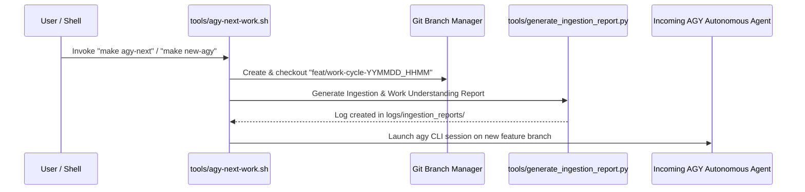

# Agent Ingestion & Work Understanding Framework (`AGENT_INGESTION_AND_WORK_UNDERSTANDING.md`)

This specification defines the automated **Ingestion & Work Understanding Protocol** required whenever `make agy-next` or `make new-agy` is invoked to launch a high-autonomy work cycle.

---

## ⚡ 1. Concise Protocol Overview (TL;DR)

1. **Automated Branch Checkout**: `make agy-next` / `make new-agy` automatically creates and checks out a new timestamped feature branch (`feat/work-cycle-YYMMDD_HHMM`).
2. **Ingestion Report Generation**: Executes [tools/generate_ingestion_report.py](file:///home/fekerr/src/edge-ai/tools/generate_ingestion_report.py) to audit git commit state, task history, and asset manifests.
3. **Log Report Storage**: Writes Markdown and JSON reports into `logs/ingestion_reports/ingestion_report_YYMMDD_HHMM_NNN.md`.
4. **Operational Invariants Enforced**:
   - Out-of-tree builds (`build/`, `logs/`).
   - Hardware throttling limit (<50% CPU/RAM load).
   - Rule 7 (`/dev/null` prohibition & registry).
   - Rule 8 (`YYMMDD_HHMM_NNN` timestamping).

---

## 🏛️ 2. Verbose Work Cycle Lifecycle (Step-by-Step)



---

## 🛠️ Verification Commands

```bash
# 1. Run ingestion report generator manually
python3 tools/generate_ingestion_report.py

# 2. Launch high-autonomy AGY session on a new branch with ingestion logging
make agy-next

# 3. Launch Claude 3.7 Sonnet 1-hour session on a new branch with ingestion logging
make new-agy
```
