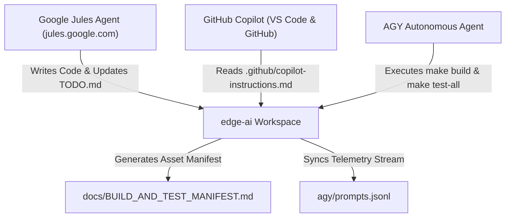

# Google Jules Agent Platform & GitHub Copilot Integration Specification (`JULES_AGENT_INTEGRATION.md`)

This specification defines the interop protocols, task sharing formats, and operational guardrails for autonomous coding agents operating via **Google Jules (`jules.google.com`)**, **GitHub Copilot** (VS Code and GitHub), and the local **AGY CLI**.

---

## ⚡ 1. Concise Integration Summary (TL;DR)

### Unified Agent Multi-Platform Matrix

| Agent System | Interface / Access Vector | Configuration Spec File | Handover Protocol |
| :--- | :--- | :--- | :--- |
| **Google Jules** | Web UI ([jules.google.com](https://jules.google.com)) / API | [.jules/config.yaml](file:///home/fekerr/src/edge-ai/.jules/config.yaml) | YAML Task Ledger & `make manifest-build` |
| **GitHub Copilot** | VS Code Extension / GitHub Web | [.github/copilot-instructions.md](file:///home/fekerr/src/edge-ai/.github/copilot-instructions.md) | `.vscode/tasks.json` & Copilot Chat |
| **AGY Local Assistant** | CLI Launcher (`./agy-next-work.sh`) | [AI.md](file:///home/fekerr/src/edge-ai/AI.md) | `make agy-sync` & `agy/prompts.jsonl` |

---

## 🏛️ 2. Verbose Architectural Interop Protocol

### A. Shared Workspace Rules Across All Agents
All agents (Google Jules, GitHub Copilot, AGY) operating within `edge-ai` are bound by the following mandatory invariants:

1. **Strict Root Hygiene (Rule 1)**: Code belongs in `src/`, make scripts in `infra/make/`, tools in `tools/`, docs in `docs/`, learning in `learning/`.
2. **Out-of-Tree Builds (Rule 4)**: Compilations land in `build/variant_name/`. Logs land in `logs/subfolder/`.
3. **No `/dev/null` Without Exceptions (Rule 7)**: Every redirection requires inline `# NECESSARY NULL PIPE:` comments and registration in [docs/PIPE_TO_NULL_EXCEPTIONS.md](file:///home/fekerr/src/edge-ai/docs/PIPE_TO_NULL_EXCEPTIONS.md).
4. **Rule 8 Timestamping**: All session logs, build outputs, and task logs use the `YYMMDD_HHMM_NNN` timestamp standard.
5. **Hardware Throttling**: Execution loops must enforce `< 50%` CPU/RAM load using [tools/monitor_system_load.py](file:///home/fekerr/src/edge-ai/tools/monitor_system_load.py).

---

### B. Task Sharing Workflow (Jules <-> Copilot <-> AGY)

1. **Task Handoff**: When an agent completes a milestone, it runs `make manifest-build` and `make agy-sync`.
2. **State Verification**: The next agent (e.g. Jules or Copilot) inspects `docs/BUILD_AND_TEST_MANIFEST.md` and [TODO.md](file:///home/fekerr/src/edge-ai/TODO.md) to resume work without state drift.
