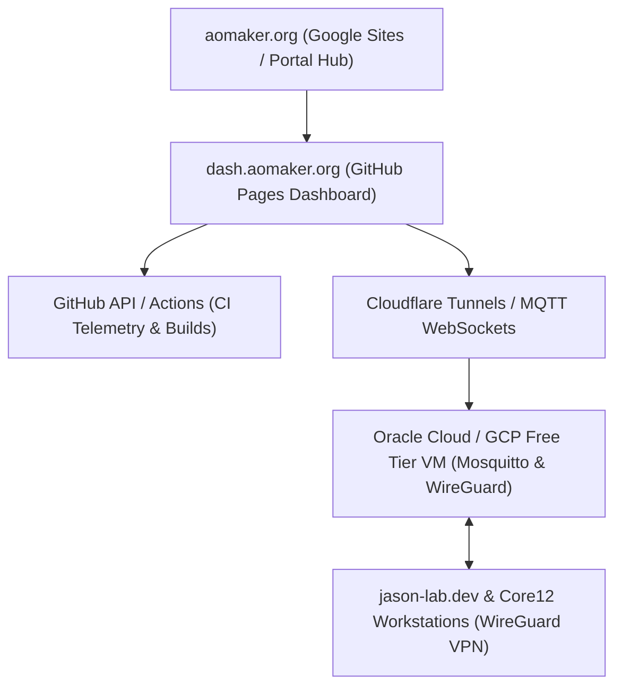

# `edge-ai` & `aomaker.org` Web Infrastructure & Dashboard Specification

**Document Standard:** `260720_0818_001`  
**Primary Domain:** `aomaker.org`  
**Partner/Lab Nodes:** `jason-lab.dev` (Acme Lab) & `edge-ai` Workspace

---

## 🌐 Vision & Ecosystem Integration

This directory details the web architecture, hosting strategies, overlay network topology, and dashboard designs for the **`edge-ai`** project and the **`aomaker.org`** maker organization.

Currently, `aomaker.org` exists as a stub web presence. This specification establishes a multi-tiered, zero/low-cost web infrastructure that bridges community maker resources (`aomaker.org`), deep silicon validation logs (`jason-lab.dev`), and real-time edge AI telemetry dashboards (`edge-ai`).

---

## 📂 Documentation Domain Structure

- **[`README.md`](file:///home/fekerr/src/edge-ai/web/README.md)**: Master ecosystem index & vision (this file).
- **[`DASHBOARD_ARCHITECTURE.md`](file:///home/fekerr/src/edge-ai/web/DASHBOARD_ARCHITECTURE.md)**: GitHub Pages, Actions, and Octokit-driven dashboard design.
- **[`INFRASTRUCTURE_AND_HOSTING.md`](file:///home/fekerr/src/edge-ai/web/INFRASTRUCTURE_AND_HOSTING.md)**: Evaluation of OCI Free Tier, GCP, Google Sites, Cloudflare, and low-cost VPS providers.
- **[`NETWORK_AND_TELEMETRY_PIPELINE.md`](file:///home/fekerr/src/edge-ai/web/NETWORK_AND_TELEMETRY_PIPELINE.md)**: WireGuard VPN overlay, Mosquitto MQTT telemetry broker, and WebSocket bridge.
- **[`AOMAKER_INTEGRATION_PLAN.md`](file:///home/fekerr/src/edge-ai/web/AOMAKER_INTEGRATION_PLAN.md)**: Migration plan for evolving `aomaker.org` from a stub site to a full portal.

---

## 🛠️ Quick Navigation & Related Specs

- **Repo Rules of Engagement**: [AI.md](file:///home/fekerr/src/edge-ai/AI.md)
- **Timestamp Standard**: [docs/TIMESTAMPING_STANDARD.md](file:///home/fekerr/src/edge-ai/docs/TIMESTAMPING_STANDARD.md)
- **AI Log Diffing**: [ai-log-diff/README.md](file:///home/fekerr/src/edge-ai/ai-log-diff/README.md)
